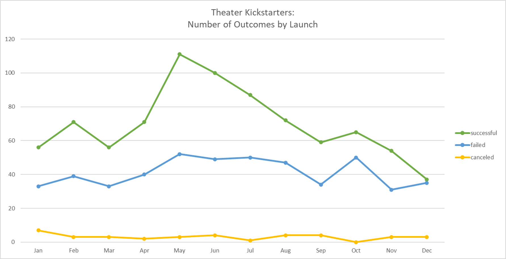
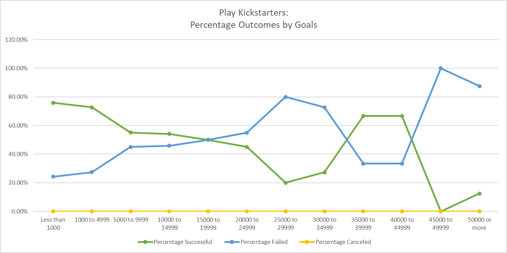

# Kickstarting with Excel
 
## Overview of Project
 
### Purpose
The goal of this project is to gain insight into how the outcomes of theater campaigns on Kickstarter are related to launch date and goal size.  
 
This project looks at the correlation of two different factors to the outcomes of theater Kickstarter campaigns, as delineated into successful, failed, or canceled. Launch date is examined with a sample size of 1,369 campaigns in the theater category. The data for campaign launch dates is spread from 2010 through 2017 and is charted by month. Goal size is analyzed with a sample size of 1,047 campaigns in the plays subcategory. The data for goal size ranges from under $1,000 to over $50,000, with groupings of $5,000 used for analysis. 
 
## Analysis and Challenges
 
### Analysis of Outcomes Based on Launch Date

For the analysis of Kickstarter outcomes based on launch date in the theater category, I utilized a pivot table in Excel. The data includes seven years of campaigns sorted by the month of their launch date. The pivot uses months for the rows while the columns consist of successful, failed, canceled, and grand total (used to check consistency). The pivot and line graph use raw numbers (rather than percentages of row, column, or grand total). This allows us to see how the volume of campaigns launched varies by month.  
 
### Analysis of Outcomes Based on Goals

For the analysis of Kickstarter outcomes based on goal size in the plays subcategory, I utilized functions in Excel, mainly SUM and COUNTIFS. The analysis groups the goal sizes into $5,000 chunks, ranging from less than $1,000 up to $5,000 or more. This grouping allows for more meaningful visualization compared to looking at each goal as a separate value. I created 8 columns for the 12 rows of goal groupings: raw number for successful, failed, canceled, and total as well as percentage for successful, failed, and canceled. For the visualization, I used percentage rather than raw numbers so that we can compare the success rate of campaigns without focusing on the volume of campaigns in each goal size category. 
 
### Challenges and Difficulties Encountered
One consideration for the analysis and visualization is the utility of percentages and raw numbers. For launch date, I used raw numbers to look at the fluctuation in volume across months; for goal size, I used percentage of row total (rows being each goal size group of $5,000) to focus on the relative success rate of each goal size group.   

Another consideration is that there are outliers in the theater category for goal size due to campaigns raising funds for performance spaces. The campaigns for performance spaces have much higher goals than those for plays or musicals. These outliers appear in the launch date analysis since the filter is set for the broader "theater" category. However, these are removed for goals centered analysis, which looks specifically at the plays subset of the theater campaigns.   

Finally, it should be noted that live data of ongoing campaigns is not included in either analysis. 
 
## Results
 
### What are two conclusions you can draw about the Outcomes based on Launch Date?

Based on the use of raw numbers, we can draw conclusions about both the overall volume of campaigns launched (the sum of all three values for a given month) as well as the relative rate of success in that month (the difference between the successful and failed values for that month). Therefore, we see that December is the lowest month both for success rate (a margin of 2 campaigns) and for number of campaigns launched. 
Conversely, we see that May is the month with the most successful campaign launches and the largest gap between successful and failed campaigns (a margin of 59 campaigns). 
 
### What can you conclude about the Outcomes based on Goals?  

Speaking in broad terms, the campaigns most likely to succeed are those with a goal size under 5k. More specifically, we see the margins for success vs failure fluctuate across the goal sizes in the following ways.  
 
The areas where the percentage of success is greater than failure: 
* less than 1k: success margin of 51%
* 1k to 15 k: steadily then sharply decreases from peak of 51% margin success 
* between 35k and 45k: 33% margin success 

The areas where the percentage failure is greater than success:
* 15k to 35k: a gap that moves from narrow to a height of 60% margin failure
* 50k or more: 75% margin failure 
 
 
### What are some limitations of this dataset?
There are a few limitations of this dataset to consider. 

First, the data is gathered from one fundraising platform, Kickstarter. Therefore, we should be cautious about extending these conclusions to other forms of fundraising. 

In terms of breadth of the sample size, we have information from about 1,000 campaigns gathered across 7 years from 2010 to 2017. When extrapolating, we should keep in mind the time period of the campaigns and any differences we might see in the fundraising landscape today.   

Last, a note about the goal size analysis: there were many more campaigns under 20k than above, which makes the percentages of higher campaign goal sizes less meaningful since they are based on fewer values (for example, we have 534 projects in the 1k to 5k group compared to 5 projects in the 25k to 30k group). 
 
### What are some other possible tables and/or graphs that we could create?
There are three main additional variables of interest in terms of possible impact on campaign outcome. 

First, we could look at the data on backers. We could compare average amount of backers and average backer contribution as a function of goal size, campaign type, or launch date.  

Additionally, we could examine the effect of a campaign being a staff pick or getting a spotlight on success.   

Finally, we could look more closely at the impact of campaign length.   

